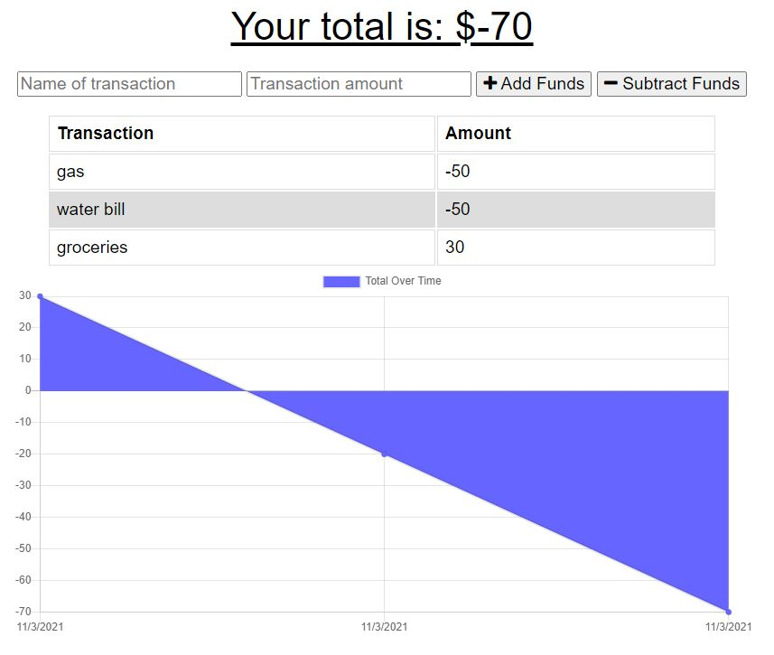

# Budget Tracker 

## Description 

I have created a budget traveler that conveniently works both online and offline. This PWA (progressive web app) is able to work offline because it features a service worker script, web app manifest and cache API. Additionally this PWA uses express and mongoose to run. 

## Installation

To install dependencies, please run the following command: 

        npm i

To start the server, please run the following command:

        node server.js

## Usage

Link to deployed application: 

Photographs of application: 

## Contact 

Please find me on GitHub [nicolepingar](https://github.com/nicolepingar) or email me at nicolepingar@gmail.com.